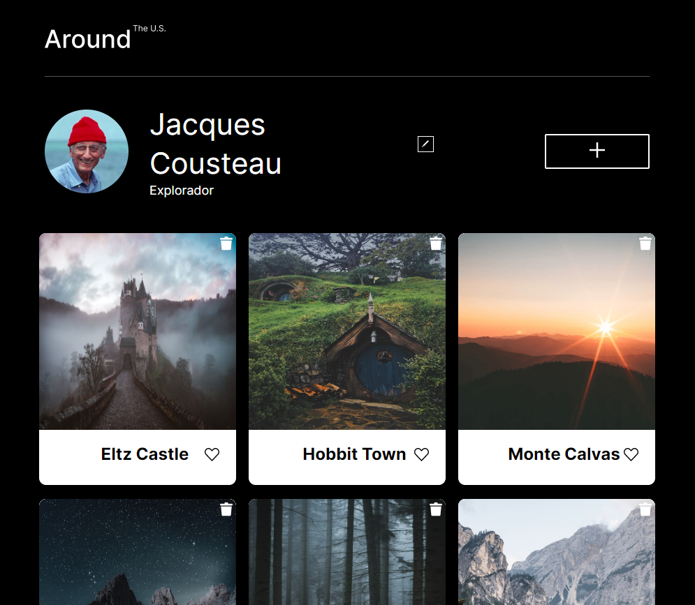

# Proyecto 5: Alrededor de los Estados Unidos

---

---

### Visita la página >>

https://devbrarum.github.io/web_project_4_esp/

---

### Descripción general

**Introducción**

Este es un proyecti que experimenta con la interactividad de javascript simulando una red social de imagenes, donde puedes editar el nombre de perfil, añadir nuevos posts, dar like o eliminar los posts.

### Actualizaciones

- Estructura BEM :ok_hand:
- Uso de reglas-at @import
- Aplicación de responsividad
- Implementacion de Javascript
- Manipulacion DOM

---

### Tecnologias Usadas

- HTML
- CSS
- Visual Studio
- Figma
- javascript

---

**Figma**

- [Enlace al proyecto en Figma](https://www.figma.com/file/i6HpqEzmTcK6wgBE7Dn4aZ/Web_Brief_Sprint_6_ES-%7C-Alrededor-de-los-EEUU-%7C-desktop-%2B-mobile?type=design&node-id=0-1&mode=design&t=UpICRQC8o4XnTNpY-0)

**Imágenes**

A la hora de trabajar, debes optar por exportar las imágenes directamente desde Figma; te recomendamos hacerlo para practicar más. No olvides optimizarlas [aquí](https://tinypng.com/), para que tu proyecto cargue más rápido.

¡Esperamos que te diviertas con JavaScript!
